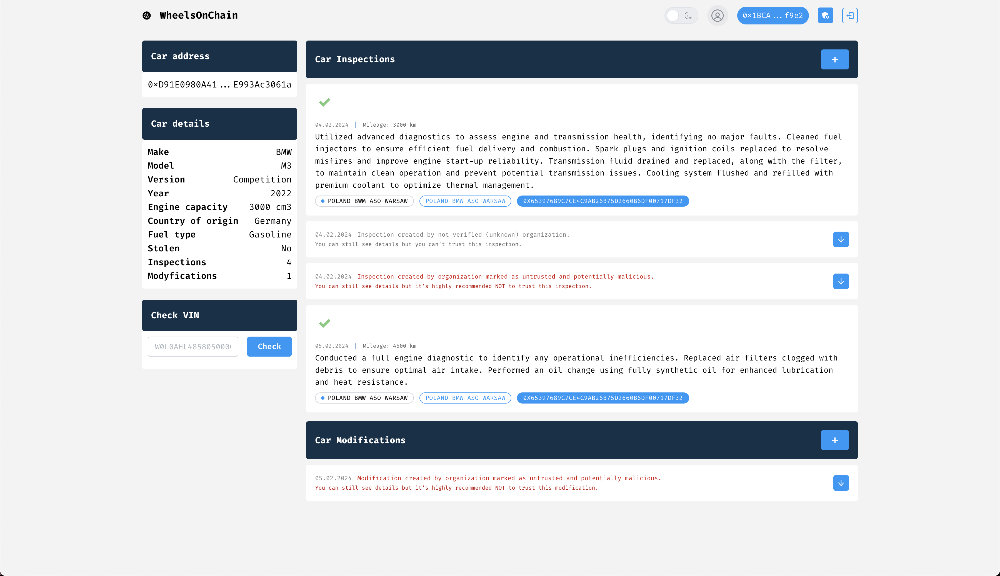
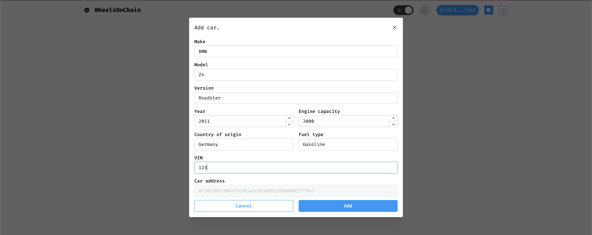
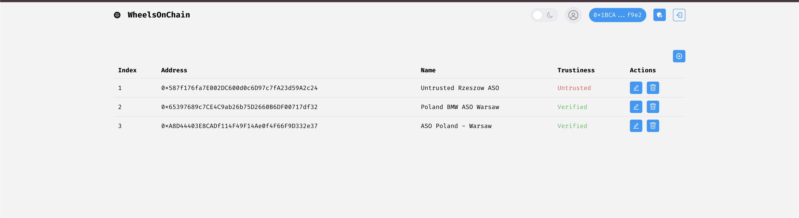
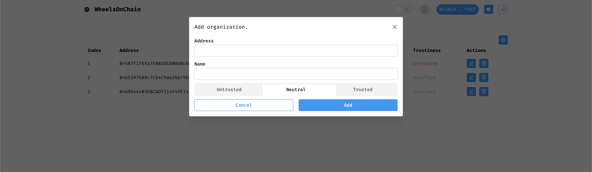

# WheelsOnChain - Vehicle History Management System

WheelsOnChain is a blockchain-based (PoC) application designed to securely store and track the history of vehicles. Utilizing Ethereum smart contracts, this system provides immutable, transparent, and trustworthy records of vehicle modifications, inspections, and ownership details. The project consists of three main components: a Solidity smart contract for blockchain storage, a .NET backend for trusted address management, and a React-based frontend for interacting with the system.

## Table of Contents
- [Introduction](#introduction)
- [Key Features](#key-features)
- [Architecture](#architecture)
- [Smart Contract (Solidity)](#smart-contract-solidity)
- [Backend (ASP.NET)](#backend-aspnet)
- [Frontend (React)](#frontend-react)
- [Technology Stack](#technology-stack)
- [Installation](#installation)
- [Usage](#usage)
- [Note](#note)
- [License](#license)

## Introduction
WheelsOnChain addresses the challenges of verifying and maintaining trustworthy vehicle history data, which is often scattered across various entities. With traditional methods prone to manipulation, the blockchain offers a decentralized, tamper-proof solution that ensures reliability. WheelsOnChain uses Ethereum smart contracts to store vehicle details, including inspections and modifications, while a backend validates trusted sources, and a frontend provides an easy interface for users.

## Key Features
- **Immutable Vehicle Records**: Store vehicle data like VIN, model, inspections, and modifications on the Ethereum blockchain.
- **Trusted Entity Management**: A .NET backend manages which addresses are considered trustworthy for providing vehicle inspections and modifications.
- **Decentralized Architecture**: Vehicle data is stored securely on the blockchain, ensuring data cannot be tampered with or lost.
- **User Interface**: A React frontend that enables users to:
  - Add vehicles, inspections, and modifications.
  - View vehicle history.
  - Check if inspections were performed by trusted entities.
- **Security**: Sensitive information, such as VIN numbers, is hashed before being stored on the blockchain for privacy.

## Architecture
WheelsOnChain consists of three primary layers:
1. **Smart Contract (Solidity)**: Handles core logic for vehicle history, including adding vehicles, inspections, and modifications.
2. **Backend (ASP.NET)**: Acts as a CRUD service for managing trusted blockchain addresses and providing context for trusted entities.
3. **Frontend (React)**: The user interface through which users interact with the system to view or submit vehicle-related data.

### Diagram
The architecture is composed of these layers that communicate with the blockchain to ensure immutability while offering a scalable solution for different frontend implementations.

## Smart Contract (Solidity)
The core of WheelsOnChain is the `CarHistory.sol` smart contract, written in Solidity. This contract stores all essential vehicle data on the Ethereum blockchain, ensuring data is immutable and decentralized.

- **Core Structures**: 
  - `Car`: Holds vehicle details (model, year, hashed VIN, status).
  - `Modification`: Stores information about vehicle modifications (description, cost).
  - `Inspection`: Records vehicle inspections (date, mileage).
  
- **Key Methods**:
  - `addCar()`: Register a new vehicle.
  - `addModification()`: Log a modification made to a vehicle.
  - `addInspection()`: Record an inspection for a vehicle.
  - `getCar()`, `getModifications()`, `getInspections()`: Retrieve data about a vehicle's history.
  - `setStolen()`: Mark a vehicle as stolen.
  
The contract also includes access control mechanisms to ensure only vehicle owners can update records.

## Backend (ASP.NET)
The .NET backend serves as a trusted authority that validates which Ethereum addresses are recognized as trusted entities, such as authorized mechanics or inspection centers. 

- **Features**:
  - CRUD operations for trusted organizations.
  - Provides APIs for the frontend to verify if a specific address is trusted.
  - Manages user authentication and administrative tasks for overseeing the system.

## Frontend (React)
The frontend is a user-friendly React-based interface that enables users to interact with the blockchain. 

- **Key Features**:
  - Vehicle Registration: Add a new vehicle to the blockchain.
  - Vehicle History: View detailed history of inspections and modifications.
  - Trusted Entity Verification: Check if inspections or modifications were performed by verified and trusted entities.
  - Secure Interactions: Uses the Web3React library to facilitate Ethereum-based interactions, allowing users to connect their wallets and sign transactions.

## Technology Stack
- **Blockchain**: 
  - Ethereum: Decentralized network for secure data storage.
  - Solidity: Programming language for smart contract development.
- **Frontend**:
  - React: UI library for building dynamic user interfaces.
  - Web3React: For connecting the frontend to the Ethereum blockchain.
- **Backend**:
  - ASP.NET Core: For handling trusted organization management and API services.
  - PostgreSQL: Database for storing trusted addresses and user details.
- **Development Tools**:
  - Remix IDE: Used for developing and deploying the smart contract.

## Installation
To run this project locally, follow these steps:

### Prerequisites
- Node.js and npm installed.
- .NET 7.0 SDK.
- PostgreSQL installed.
- Ethereum testnet (Rinkeby or Goerli) for deploying the contract.

### Backend Setup
1. Clone the repository:
   ```bash
   git clone https://github.com/yourusername/WheelsOnChain.git
   cd WheelsOnChain/backend
   ```
2. Set up PostgreSQL and update the connection string in `appsettings.json`.
3. Restore the .NET dependencies:
   ```bash
   dotnet restore
   ```
4. Run the backend API:
   ```bash
   dotnet run
   ```

### Frontend Setup
1. Navigate to the frontend directory:
   ```bash
   cd ../frontend
   ```
2. Install dependencies:
   ```bash
   npm install
   ```
3. Start the frontend:
   ```bash
   npm start
   ```

### Smart Contract Deployment
1. Use Remix IDE to deploy `CarHistory.sol` to an Ethereum testnet.
2. Update the frontend with the contract's deployed address in the configuration file.

## Usage
- Register a vehicle by providing the necessary details such as VIN, model, and year.
- Add an inspection or modification through the frontend.
- View the full history of a vehicle, including who performed each inspection or modification, and verify if it was done by a trusted entity.
- Mark vehicles as stolen and check for any alerts regarding thefts.


## Application







## Admin panel






## Note
I'm not primarily a frontend developer, and the frontend has many flaws. It should be considered as a **Proof of Concept (PoC)** rather than a production-ready interface.

## License
This project is licensed under the MIT License - see the [LICENSE](LICENSE) file for details.
